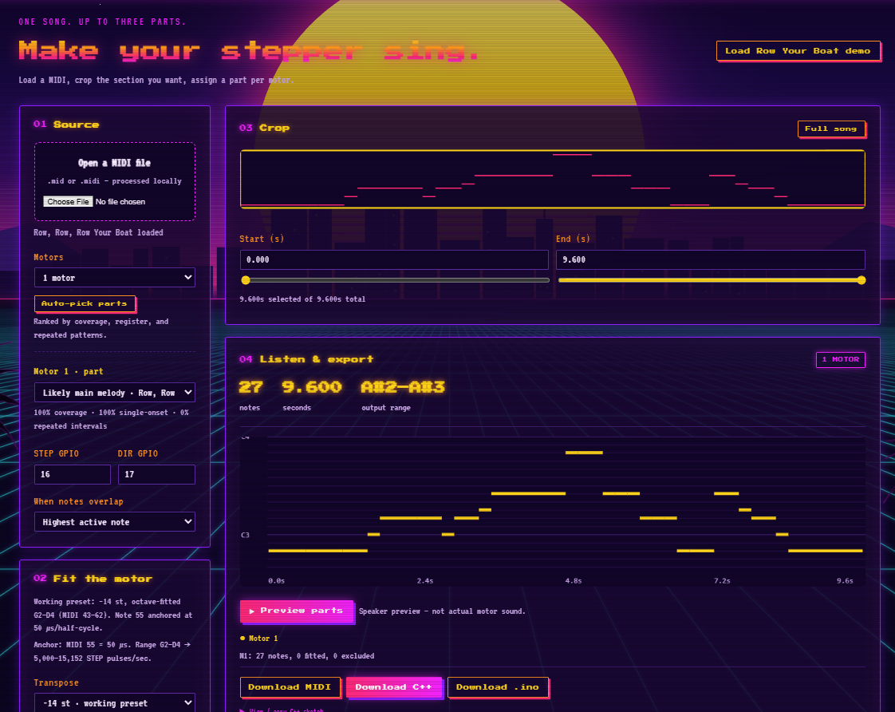
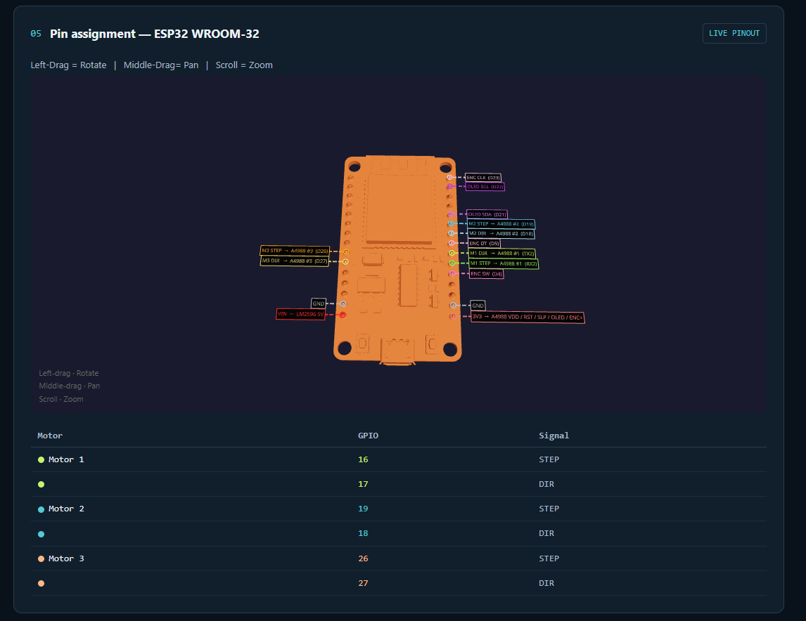

# Stepper Melody Lab

Turn any MIDI file into music played by stepper motors. Load a song, pick up to three parts, and export a ready-to-flash ESP32 sketch that drives one A4988 per motor.

## Screenshots




[See Sample to pull this off](https://github.com/user-attachments/assets/e5c6caaa-9108-4ada-9df3-ce44aea71a5b)

## What it does

- **Parses MIDI** (format 0/1) in the browser: tempo changes, sustain pedal, percussion excluded. Nothing is uploaded.
- **Auto-picks parts.** Ranks tracks by coverage, register, and repeated patterns to guess the melody. Manual override per motor.
- **Crops** any section of the song with a timeline preview.
- **Fits the motor's range.** Transposes −14 semitones, then octave-folds into G2–D4 (MIDI 43–62), anchored at note 55 = 50 µs half-period.
- **Preserves rests.** Gaps in the MIDI become zero-pulse segments, so the motor holds still.
- **Previews** the parts through your speakers.
- **Exports** a complete non-blocking `.cpp` sketch (or `.ino`, or a cropped MIDI). Each motor gets its own pulse schedule and all start together.
- **3D wiring view.** An interactive ESP32 model shows every connection. Motor wires update with the 1/2/3 motor selector.





## Hardware

| Part | Qty |
|---|---|
| ESP32 DevKit (WROOM-32, 30-pin) | 1 |
| A4988 stepper driver | 1–3 |
| NEMA 17 stepper (unloaded for music) | 1–3 |
| 100 µF capacitor (VMOT to GND, close to each driver) | 1 per driver |
| 12 V supply (motor power) | 1 |
| LM2596 buck converter, set to 5 V (ESP32 VIN) | 1 |

### Default wiring

| Signal | ESP32 pin |
|---|---|
| M1 STEP / DIR | RX2 (16) / TX2 (17) |
| M2 STEP / DIR | D19 / D18 |
| M3 STEP / DIR | D26 / D27 |
| A4988 VDD, RST+SLP, MS1–3 | 3V3 |
| A4988 EN | GND |
| A4988 VMOT | 12 V + |
| All grounds | Common GND |

MS1–MS3 all HIGH selects 1/16 stepping. Every motor needs its own STEP/DIR pair to play an independent part.

## Run it

```bash
npm install
npm run dev
```

Open the localhost URL Vite prints.

## Stack

React 18, Vite 5, three.js, @react-three/fiber, @react-three/drei. The ESP32 model is converted from STEP to GLB.
